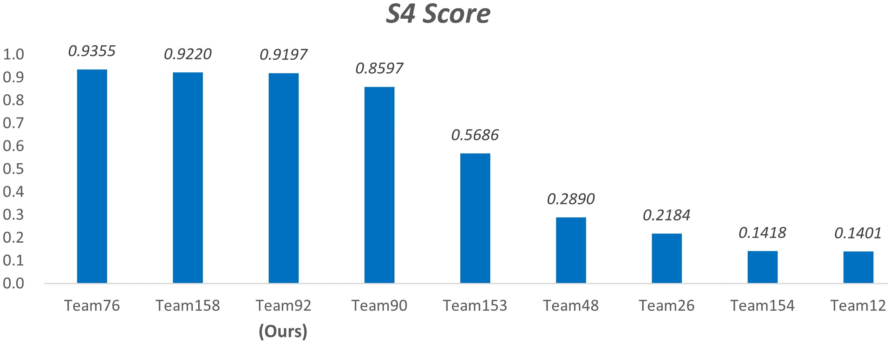

🥉News: our team took the 3rd place in the AICity 2021 Challenge on Track 4

## Dual-Modality Vehicle Anomaly Detection via Bilateral Trajectory Tracing (CVPRW 2021)
[Paper Link](https://openaccess.thecvf.com/content/CVPR2021W/AICity/papers/Chen_Dual-Modality_Vehicle_Anomaly_Detection_via_Bilateral_Trajectory_Tracing_CVPRW_2021_paper.pdf)

[Paper-with-code](https://paperswithcode.com/paper/dual-modality-vehicle-anomaly-detection-via)

[ArXiv Link to the Paper](https://arxiv.org/abs/2106.05003)

### Introduction
This is the source code for Team WHU_IIP for track 4 Anomaly Detection in AICity 2021 Chellenge.

Our experiments conducted on the Track 4 testset yielded a result of 0.9302 F1-Score and 3.4039 root mean square error (RMSE), which performed 3rd place in the challenge.


<p align="center">Fig1  Rank of our team</p>


More implementation details are displayed in the paper—— 
*Dual-Modality Vehicle Anomaly Detection via Bilateral Trajectory Tracing* 

The paper link will be added after CVPRW2021. 
Here we only show the flow chart for better understanding of the following procedures.  


<p align="center">Fig2  Flow Chart</p>

## Our Solution for NVIDIA AICity Challenge 2021 Track4

### Requirements
- Linux (tested on Ubuntu 16.04.5)
- Packages (listed in the requirements.txt)

### Annotations
We have annotated <font color=red>3657</font> images selected from training dataset. The training set and testing set are randomly split at the ratio of 4:1. The link for annotation is included as follows.

Annotations link: [Google drive](https://drive.google.com/drive/folders/1Wk_XdqGOMSBMzRcCY1C1k_NHFKwzbHZb?usp=sharing)

### Procedures

#### Background Modeling
##### Extract the background
``` 
cd bg_code
python ex_bg_mog.py
```

#### Preparation For Detection 
##### Structure of *PreData* Folder
The orginal videos and the their frames are put under `../PreData/Origin-Test` and `../PreData/Origin-Frame` folders, respectively. And the background modeling results are put under `../PreData/Forward-Bg-Frame` folder.

All these files are organized for the Detect Step later and then the detection results based on background modeling will be saved under  `../PreData/Bg-Detect-Result/Forward_full` for each videos while `../PreData/Bg-Detect-Result/Forward` is saved in frames seperated from full videos.

Detailed structure is shown as below.
``` 
├── Bg-Detect-Result
│   ├── Forward
│       └── 1
│          ├──test_1_00000.jpg.npy
│          ├──test_1_00001.jpg.npy
│          ├──test_1_00002.jpg.npy
│          └── ...
│       ├── 2
│       ├── 3
│       └── ...
│   └── Forward_full
│       ├── 1.npy
│       ├── 2.npy
│       ├── 3.npy
│       └── ...
├── Forward-Bg-Frame
│   ├── 1.mp4
│   ├── 2.mp4
│   ├── 3.mp4
│   └── ...
├── Origin-Frame
│   └── 1
│       ├──1_00001.jpg
│       ├──1_00002.jpg
│       ├──1_00003.jpg
│       └── ...
│   ├── 2
│   ├── 3
│   └── ...
├── Origin-Test
│   ├── 1.mp4
│   ├── 2.mp4
│   ├── 3.mp4
│   └── ...
```

#### Detection 
For detection model training instruction, please view the [official yolov5 repo](https://github.com/ultralytics/yolov5)
#### Road Mask Construction
##### Extract Motion-Based Mask
``` 
cd mask_code
python mask_frame_diff.py start_num end_num
```
##### Extract Trajectory-Based Mask
``` 
python mask_track.py video_num
```
##### Mask Fusion
``` 
python mask_fuse.py video_num
```

#### Pixel-Level Tracking
##### Coarse Detect
``` 
cd pixel_track/coarse_ddet
python pixel-level_tracking.py start_num end_num
```
##### Fuse Similar Results
``` 
cd pixel_track/post_process
python similar.py start_num end_num
```
##### Filter Suspicious Anomaly Results
``` 
python filter.py
```
##### Fuse Close Results
```
python pixel_fuse.py
```
##### ROI Backtracking for Pixel-Level
```
python timeback_pixel.py type_num start_num end_num
```
##### Fuse Tracking Results
```
python sync.py
```

#### Box-Level Tracking

##### 
##### ROI Backtracking for Box-Level

#### Dynamic Analysis Stage
We mainly contribute this to trace the exact time of crashing since what's done before can only be used to locate the time when abnormal vehicles become static.

##### Multiple Vehicle Trajectory Tracing
```
cd car_crash
python crash_track.py
```
##### Singular Vehicle Trajectory Tracing


### Demo
#### Multiple Vehicle Trajectory Tracing
Statistically, vehicle crashes often come up with sharp turns, which is the primary reaction of drivers when encountering such anomalies. Here we list some typical scenarios to display that.


#### Singular Vehicle Trajectory Tracing


<div align=center></div>
<div align=center></div>
<div align=center></div>
<div align=center></div>


## 
If you have any question, please feel free to
contact us. (jchen157@u.rochester.edu and yuchen_yang@whu.edu.cn)
